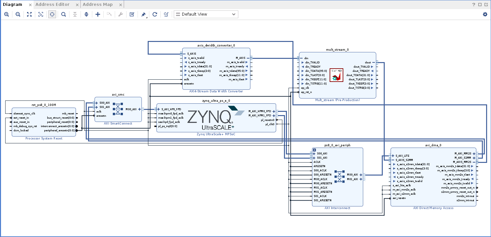

# PYNQ-ap_fixed-converter

## Overview
This repo contains a small code meant to work with PYNQ framework + Vivado/Vitis_HLS tools. 

One of the commonly used data types in FPGA development is the ap_fixed. It can be imported in your Vivado/Vitis HLS using the ```#include <ap_fixed.h>``` directive inside your HLS code. It allows the developer to declare fixed point data types, which are knows to be better than floating point for some applications, since they do not need heavy use of dsp and resources.

PYNQ is a framework that allows the user to control the board using high level Python code. Once the hardware design has been exported and mounted on the board, the developer can rely on Python and its vast amount of libraries to write code and control the hardware. 

However, Python doesn't support ap_fixed data types, so we need to convert our float/int/ecc... Python data types to something that is compatible with our hardware ports/interfaces. 


## Example

This is our simple IP code inside Vitis HLS:


    #include "ap_axi_sdata.h"
    #include "hls_stream.h"
    #include <ap_fixed.h>

    typedef struct {
      ap_fixed<28, 6> first_value;
      ap_fixed<28, 6> second_value;
      ap_fixed<28, 6> third_value;

    } my_data_struct;

    typedef hls::axis<my_data_struct,0,0,0> pkt_t;

    typedef hls::axis<ap_fixed<28,6>,0,0,0> pkt_t_out;

    void mult_stream(
        hls::stream< pkt_t > &din,
        hls::stream< pkt_t_out > &dout ) {
      #pragma HLS INTERFACE ap_ctrl_none port=return
      #pragma HLS INTERFACE axis port=din
      #pragma HLS INTERFACE axis port=dout

      pkt_t pkt;
      pkt_t_out pkt_out;

      din.read(pkt);

      pkt_out.data = pkt.data.first_value + pkt.data.second_value + pkt.data.third_value;
      pkt_out.last = pkt.last;
      pkt_out.keep = pkt.keep;
      pkt_out.strb = pkt.strb;

      dout.write(pkt_out);
    }
Which sums 3 input numbers. 

We export our IP and we can test it with the following block design: 



We are using an **axis data width converter** to convert the output size of the DMA into something compatible with our input IP. In fact, the DMA only accepts stream dimension that are power of 2 (32,63,128, ecc...), while our IP has a streaming size of 96 bits. <br> The data width converter aggregates multiple writes into a single one. <br> Basically our DMA will perform 3 writes of 32 bits which will be buffered into the data width converter and then sent all together to our IP (32+32+32 = 96 bits of data). 
Docs [here](https://www.xilinx.com/support/documentation/ip_documentation/axis_infrastructure_ip_suite/v1_1/pg085-axi4stream-infrastructure.pdf).

Finally, we have to synthesize our  design and import it into our board. You can find more [here](https://www.youtube.com/watch?v=Dupyek4NUoI&ab_channel=FPGADeveloper)

FInally we can test our design with a Python notebook, you can find the full code here.


